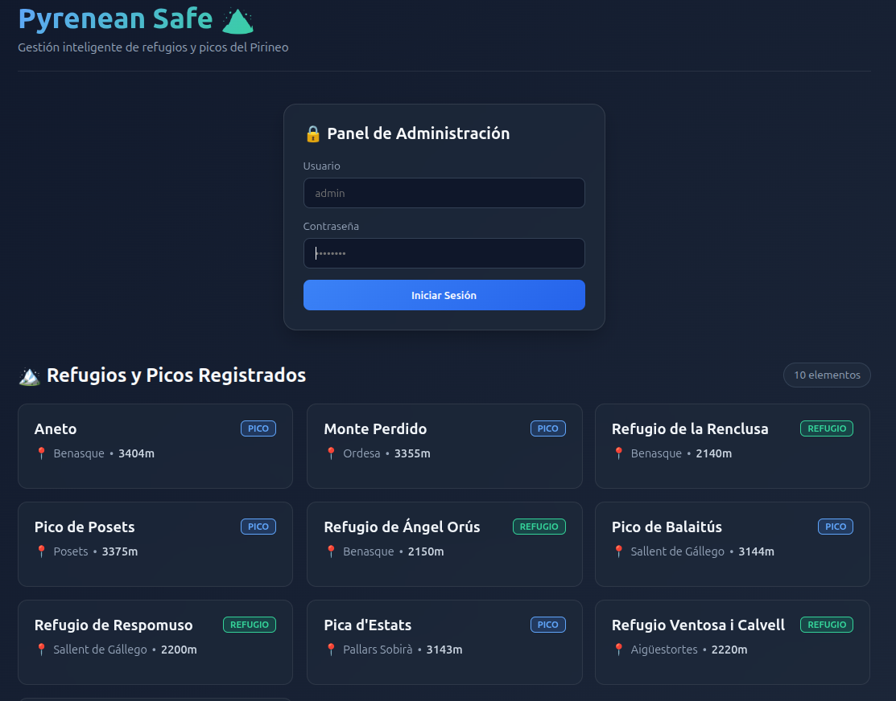

# 🏔️ Pyrenean Safe

**Pyrenean Safe** es una aplicación web full-stack diseñada para la gestión inteligente, consulta pública y administración segura de refugios y picos de alta montaña en los Pirineos. El proyecto implementa una arquitectura moderna de extremo a extremo, separando un backend robusto basado en APIs REST y seguridad avanzada de un frontend moderno y visualmente optimizado.

---

## 🚀 Características Principales

* **Consulta Pública**: Listado abierto y accesible de picos y refugios de montaña con información de ubicación, elevación y tipo.
* **Autenticación y Seguridad (JWT)**: Sistema de acceso protegido para administradores mediante JSON Web Tokens (JWT) y cifrado de contraseñas con BCrypt.
* **Control de Acceso Basado en Roles (RBAC)**: Operaciones críticas restringidas exclusivamente al rol de administrador (`ROLE_ADMIN`).
* **Operaciones CRUD Completas**: Capacidad de Crear, Leer, Actualizar y Eliminar registros directamente desde la interfaz de administración.
* **Interfaz de Usuario Moderna (Dark Alpine UI)**: Diseño visual optimizado con estética alpina, tarjetas interactivas (*glassmorphism*) y ayudas visuales para facilitar las pruebas rápidas.

---

## 🛠️ Tecnologías Utilizadas

### Backend
* **Java 17+** / **Spring Boot**
* **Spring Security** (Protección por token JWT y `@PreAuthorize`)
* **Spring Data JPA** / **Hibernate**
* **PostgreSQL** (Base de datos relacional)
* **Docker & Docker Compose** (Contenedorización de la base de datos)

### Frontend
* **Vue.js 3** (Composition API)
* **Vite** (Empaquetador y entorno de desarrollo rápido)
* **CSS Moderno / Variables CSS** (Diseño personalizado adaptado al modo oscuro)

---

## 📂 Estructura del Proyecto

```text
pyrenean-safe/
├── backend/                  # Servidor Spring Boot y configuración de Docker
│   ├── src/main/java         # Controladores, modelos, servicios y seguridad
│   └── docker-compose.yml    # Configuración de PostgreSQL
└── frontend/                 # Aplicación Vue.js 3
    ├── src/
    │   ├── components/       # Componentes modulares (Login, Formularios, Listados)
    │   ├── services/         # Servicios HTTP (Auth y Shelters)
    │   ├── App.vue           # Componente raíz
    │   └── style.css         # Estilos globales personalizados
    └── package.json
```
## ⚙️ Guía de Puesta en Marcha (Local)
* Sigue estos pasos para clonar y ejecutar el proyecto en tu entorno local:

1. Clonar el repositorio
git clone [https://github.com/gestionarlaweb/pyrenean-safe.git](https://github.com/gestionarlaweb/pyrenean-safe.git)

    cd pyrenean-safe

2. Levantar la base de datos (Docker)
Accede a la carpeta del backend y arranca el contenedor de PostgreSQL:

    cd backend
    docker compose up -d

3. Ejecutar el Backend
Manteniendo la base de datos activa, arranca la aplicación de Spring Boot:

    mvn spring-boot:run

(El backend se iniciará en http://localhost:8080 e inicializará automáticamente un usuario administrador por defecto).

4. Ejecutar el Frontend
Abre una nueva terminal, navega hasta la carpeta del frontend, instala las dependencias y arranca el servidor de desarrollo:

    cd ../frontend

    npm install

    npm run dev

(El frontend estará disponible en http://localhost:5173).

## 🔑 Credenciales de Acceso (Administrador)
Para probar las funciones protegidas de administración (Crear, Editar, Eliminar) desde la interfaz web, utiliza las siguientes credenciales de prueba que se muestran en el panel de acceso:

    Usuario: admin

    Contraseña: admin123

NOTA: No me peteis el backend, ser respectuosos para que otros usuarios puedan probar, gracias !!!

## 👤 Autor
Desarrollado por David (gestionarlaweb@gmail.com).

## 📸 Vista Previa de la Aplicación



> **NOTA:** No me petéis el backend, sed respetuosos para que otros usuarios puedan probarlo, ¡gracias! 🙏